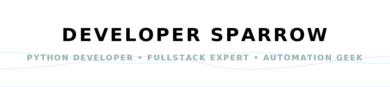

<h1 align="center"></h1>

  
  
  

---

  

<h2 align="center">👋 Welcome, I'm Developer Sparrow!</h2>

  <strong>🔥 Senior Python Developer & Fullstack Expert | Bot Automations Specialist 🔥</strong>

  <i>Building smart, secure, and state-of-the-art automated systems for Telegram and the Web. Deeply passionate about core technology, network security, and fullstack cloud architectures.</i>

---

### 🚀 About Me
- 🏫 **Specialization:** Information Technology & Fullstack Engineering.
- 🔭 **Working on:** Advanced Telegram Music Bots and private automated infrastructures.
- 🌱 **Learning & Research:** Cloud Security, Network Defense, and advanced Web API optimizations.
- 🏴‍☠️ **Interests:** Network security audit, web vulnerability assessment, and cloud microservices.
- 🎵 **Passions:** Tech, Millennial pop, deep beats, and building cool stuff for the open-source community!

---

### 🛠️ Tech Stack & Skills

<table>
  <tr>
    <td valign="top" width="50%">
      <h4>💻 Languages & Frameworks</h4>
      
       
      
       
      
      
    </td>
    <td valign="top" width="50%">
      <h4>🔧 Tools & Environments</h4>
      
       
      
       
      
      
    </td>
  </tr>
</table>

---

### 📊 GitHub Stats & Metrics

  &nbsp;
  

  

---

### 🌐 Connect With Me

  
  

---

  <i>Built with 💙 by Developer Sparrow</i>

